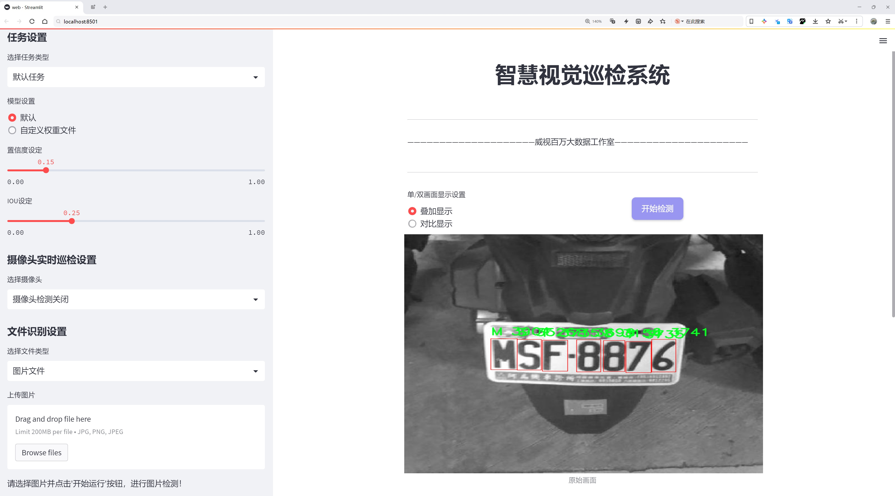
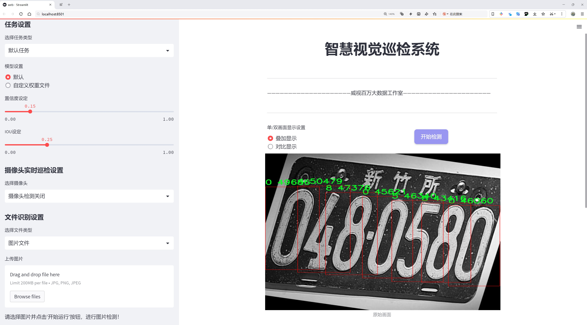
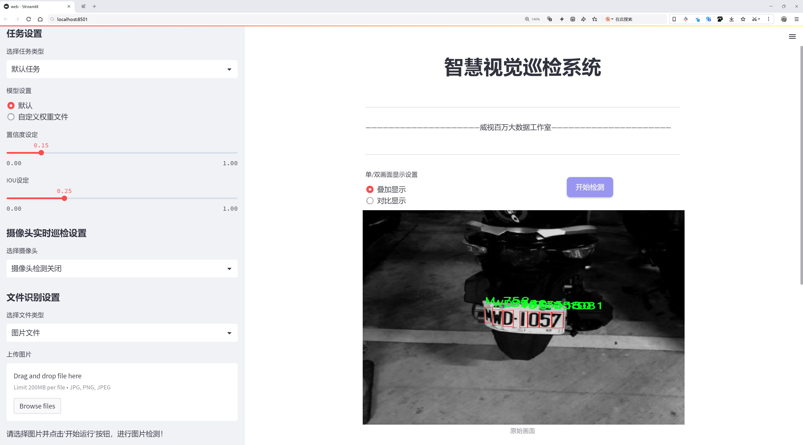
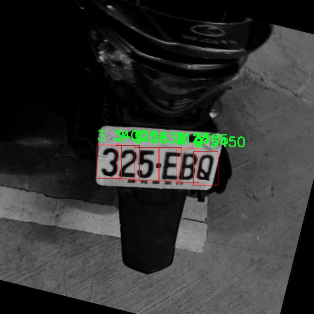
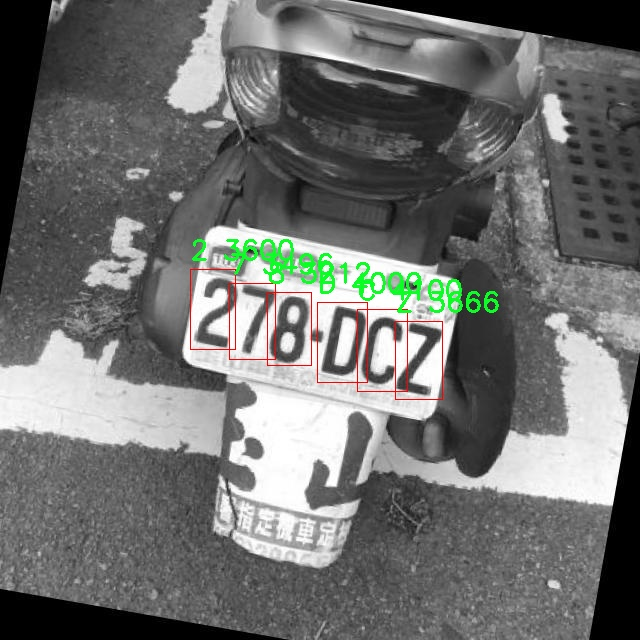
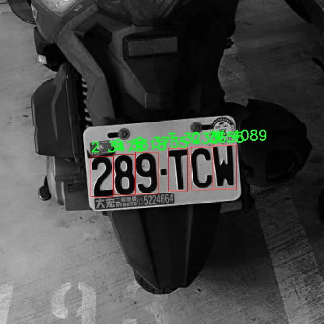
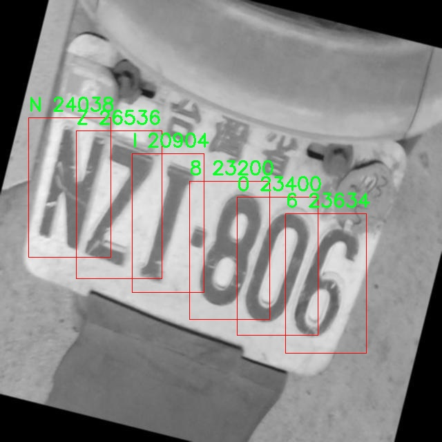
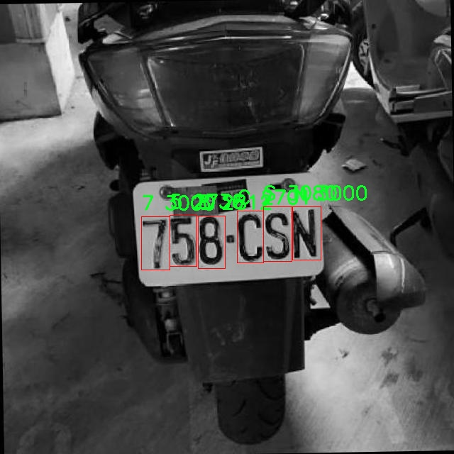

# 电动车车牌识别检测系统源码分享
 # [一条龙教学YOLOV8标注好的数据集一键训练_70+全套改进创新点发刊_Web前端展示]

### 1.研究背景与意义

项目参考[AAAI Association for the Advancement of Artificial Intelligence](https://gitee.com/qunmasj/projects)

项目来源[AACV Association for the Advancement of Computer Vision](https://kdocs.cn/l/cszuIiCKVNis)

研究背景与意义

随着电动车的普及，交通管理与安全问题日益凸显。电动车作为一种环保、经济的出行方式，受到了越来越多消费者的青睐。然而，电动车的快速增长也带来了新的挑战，尤其是在交通监控和管理方面。车牌识别技术作为智能交通系统的重要组成部分，能够有效提高交通管理的效率和准确性。因此，基于改进YOLOv8的电动车车牌识别系统的研究具有重要的现实意义和应用价值。

YOLO（You Only Look Once）系列模型因其高效的实时目标检测能力而广泛应用于各类视觉识别任务。YOLOv8作为该系列的最新版本，进一步提升了检测精度和速度，适合于复杂环境下的目标识别。电动车车牌识别系统的设计，旨在利用YOLOv8的优势，针对电动车的特征进行优化，以实现更高效的车牌识别。该系统不仅可以提高电动车的通行效率，还能为交通执法提供有力支持，助力智慧城市的建设。

在本研究中，我们使用的电动车车牌数据集包含4325张图像，涵盖35个类别的字符（包括数字和字母），为模型的训练和测试提供了丰富的样本。这些数据的多样性和丰富性，能够有效提高模型的泛化能力，使其在实际应用中表现更加优异。通过对数据集的深入分析，我们可以识别出电动车车牌的特征，包括字体、颜色、形状等，从而为后续的模型改进提供依据。

在电动车车牌识别的实际应用中，环境因素如光照变化、天气条件、拍摄角度等都会对识别效果产生影响。因此，改进YOLOv8模型时，我们将重点关注这些影响因素，采用数据增强技术和模型优化策略，以提高系统在复杂环境下的鲁棒性和准确性。此外，结合深度学习技术，我们还将探索多模态数据融合的方法，以进一步提升识别性能。

本研究的意义不仅在于技术的创新，更在于其对社会发展的积极推动。随着电动车数量的增加，传统的交通管理手段已难以满足日益增长的需求。基于改进YOLOv8的电动车车牌识别系统，将为交通管理提供一种高效、智能的解决方案，助力交通管理部门实时监控电动车的行驶情况，减少交通违法行为，提高道路安全性。同时，该系统的成功应用，也将为其他类型车辆的识别提供借鉴，推动智能交通技术的广泛应用。

综上所述，基于改进YOLOv8的电动车车牌识别系统的研究，不仅具有重要的学术价值，也为实际应用提供了切实可行的解决方案。通过对电动车车牌识别技术的深入研究，我们期待能够为智能交通的发展贡献一份力量，推动社会的可持续发展。

### 2.图片演示







##### 注意：由于此博客编辑较早，上面“2.图片演示”和“3.视频演示”展示的系统图片或者视频可能为老版本，新版本在老版本的基础上升级如下：（实际效果以升级的新版本为准）

  （1）适配了YOLOV8的“目标检测”模型和“实例分割”模型，通过加载相应的权重（.pt）文件即可自适应加载模型。

  （2）支持“图片识别”、“视频识别”、“摄像头实时识别”三种识别模式。

  （3）支持“图片识别”、“视频识别”、“摄像头实时识别”三种识别结果保存导出，解决手动导出（容易卡顿出现爆内存）存在的问题，识别完自动保存结果并导出到tempDir中。

  （4）支持Web前端系统中的标题、背景图等自定义修改，后面提供修改教程。

  另外本项目提供训练的数据集和训练教程,暂不提供权重文件（best.pt）,需要您按照教程进行训练后实现图片演示和Web前端界面演示的效果。

### 3.视频演示

[3.1 视频演示](https://www.bilibili.com/video/BV1VgsQesEoJ/)

### 4.数据集信息展示

##### 4.1 本项目数据集详细数据（类别数＆类别名）

nc: 35
names: ['0', '1', '2', '3', '4', '5', '6', '7', '8', '9', 'A', 'B', 'C', 'D', 'E', 'F', 'G', 'H', 'I', 'J', 'K', 'L', 'M', 'N', 'P', 'Q', 'R', 'S', 'T', 'U', 'V', 'W', 'X', 'Y', 'Z']


##### 4.2 本项目数据集信息介绍

数据集信息展示

在现代智能交通系统中，电动车的车牌识别技术正日益成为研究的热点，尤其是在提升识别精度和速度方面。为此，本研究选用了名为“plate_dataset”的数据集，旨在训练和改进YOLOv8模型，以实现更高效的电动车车牌识别。该数据集的设计考虑了多种实际应用场景，包含了丰富的车牌字符信息，以便于模型在多样化的环境中进行学习和优化。

“plate_dataset”包含35个类别，涵盖了数字和字母的组合，这些类别包括从0到9的数字以及从A到Z的字母。具体来说，数据集的类别列表为：'0', '1', '2', '3', '4', '5', '6', '7', '8', '9', 'A', 'B', 'C', 'D', 'E', 'F', 'G', 'H', 'I', 'J', 'K', 'L', 'M', 'N', 'P', 'Q', 'R', 'S', 'T', 'U', 'V', 'W', 'X', 'Y', 'Z'。这些字符不仅是电动车车牌的基本组成部分，也是实现高效识别的关键因素。

在数据集的构建过程中，考虑到了多种影响因素，如光照变化、车牌的污损程度、不同的拍摄角度以及背景的复杂性等。这些因素都可能对车牌识别的准确性产生影响，因此数据集中的样本经过精心挑选和标注，以确保其在训练过程中的有效性和代表性。通过这种方式，研究者能够确保模型在实际应用中具有良好的泛化能力，能够适应不同的环境和条件。

此外，数据集中的样本数量也经过精心设计，以保证训练过程的充分性和有效性。每个类别的样本数量均衡分布，使得模型在学习过程中不会偏向某一特定类别，从而提高了整体的识别精度。这种均衡性对于电动车车牌识别系统的实际应用至关重要，因为在不同的场景中，可能会遇到各种不同的车牌组合和样式。

在训练过程中，YOLOv8模型将利用“plate_dataset”中的丰富信息，通过深度学习算法进行特征提取和模式识别。模型将学习如何从输入图像中准确定位和识别车牌字符，并将其转化为可读的文本信息。这一过程不仅需要大量的计算资源，还需要高质量的数据集作为支撑。正因如此，“plate_dataset”的构建和应用成为了本研究成功的关键因素之一。

综上所述，“plate_dataset”作为本研究的核心数据来源，其多样化的类别设置和丰富的样本信息为电动车车牌识别系统的训练提供了坚实的基础。通过对该数据集的深入分析和有效利用，研究者期望能够显著提升YOLOv8模型在电动车车牌识别任务中的表现，从而推动智能交通技术的发展和应用。











### 5.全套项目环境部署视频教程（零基础手把手教学）

[5.1 环境部署教程链接（零基础手把手教学）](https://www.ixigua.com/7404473917358506534?logTag=c807d0cbc21c0ef59de5)


[5.2 安装Python虚拟环境创建和依赖库安装视频教程链接（零基础手把手教学）](https://www.ixigua.com/7404474678003106304?logTag=1f1041108cd1f708b01a)

### 6.手把手YOLOV8训练视频教程（零基础小白有手就能学会）

[6.1 手把手YOLOV8训练视频教程（零基础小白有手就能学会）](https://www.ixigua.com/7404477157818401292?logTag=d31a2dfd1983c9668658)

### 7.70+种全套YOLOV8创新点代码加载调参视频教程（一键加载写好的改进模型的配置文件）

[7.1 70+种全套YOLOV8创新点代码加载调参视频教程（一键加载写好的改进模型的配置文件）](https://www.ixigua.com/7404478314661806627?logTag=29066f8288e3f4eea3a4)

### 8.70+种全套YOLOV8创新点原理讲解（非科班也可以轻松写刊发刊，V10版本正在科研待更新）

由于篇幅限制，每个创新点的具体原理讲解就不一一展开，具体见下列网址中的创新点对应子项目的技术原理博客网址【Blog】：


[8.1 70+种全套YOLOV8创新点原理讲解链接](https://gitee.com/qunmasj/good)

### 9.系统功能展示（检测对象为举例，实际内容以本项目数据集为准）

图9.1.系统支持检测结果表格显示

  图9.2.系统支持置信度和IOU阈值手动调节

  图9.3.系统支持自定义加载权重文件best.pt(需要你通过步骤5中训练获得)

  图9.4.系统支持摄像头实时识别

  图9.5.系统支持图片识别

  图9.6.系统支持视频识别

  图9.7.系统支持识别结果文件自动保存

  图9.8.系统支持Excel导出检测结果数据


### 10.原始YOLOV8算法原理

原始YOLOv8算法原理

YOLOv8作为YOLO系列的最新版本，继承并扩展了前几代模型的设计理念，旨在实现更高的目标检测精度和更快的处理速度。与其前身YOLOv5相比，YOLOv8在多个方面进行了显著的改进，尤其是在网络结构的设计、特征提取的效率以及目标检测的准确性等方面，体现了深度学习领域不断演进的趋势。

YOLOv8的网络结构可以分为四个主要部分：输入端、骨干网络、颈部网络和头部网络。输入端负责处理输入图像，采用了马赛克数据增强技术，这种技术通过将四张不同的图像随机缩放并拼接成一张新图像，迫使模型学习到更多的上下文信息和多样化的特征，从而提高了模型的泛化能力。此外，YOLOv8在输入阶段还引入了自适应锚框计算和自适应灰度填充，以便在不同长宽比的图像上保持高效的检测性能。

在骨干网络部分，YOLOv8采用了C2f模块，这一模块是对YOLOv5中C3模块的改进。C2f模块通过并行化多个梯度流分支，增强了特征的表达能力，形成了更为丰富的梯度流，从而提升了模型对复杂特征的学习能力。与传统的卷积层相比，C2f模块能够更有效地捕捉到图像中的细微变化，使得YOLOv8在特征提取阶段就具备了更强的表现力。同时，YOLOv8还引入了快速空间金字塔池化（SPPF）结构，能够有效提取不同尺度的特征，进一步提高了特征提取的效率。

颈部网络则采用了路径聚合网络（PAN）结构，旨在加强不同尺度特征的融合能力。PAN通过对不同层次的特征进行有效的整合，使得模型能够更好地处理不同大小的目标物体，增强了对小目标的检测能力。这样的设计使得YOLOv8在处理复杂场景时，能够有效利用多层次的特征信息，提升了整体的检测性能。

头部网络是YOLOv8的另一个重要创新点。在这一部分，YOLOv8将分类和检测过程进行了有效的解耦，采用了主流的解耦头结构。与以往的耦合头不同，解耦头结构允许分类和边界框回归分别进行处理，这样的设计不仅提高了模型的灵活性，还使得损失计算更加精确。YOLOv8在损失计算过程中引入了Task-Aligned Assigner策略，根据分类与回归的分数加权结果选择正样本，从而优化了训练过程。

值得注意的是，YOLOv8在目标检测方法上进行了根本性的变革，抛弃了传统的基于锚框的检测方式，转而采用无锚框（Anchor-Free）的方法。这一转变使得YOLOv8能够直接预测目标的中心点和宽高比例，减少了锚框预测的数量，从而加速了非最大抑制（NMS）过程，显著提高了检测速度和准确度。无锚框的设计使得YOLOv8在处理不同类型的目标时，能够展现出更强的适应性和灵活性，尤其是在面对形状和大小差异较大的物体时。

在训练过程中，YOLOv8还采用了分布焦点损失（DFLoss）和完全交并比损失（CIOULoss），以提升模型对边界框预测的精准性。这些损失函数的设计旨在使网络模型能够快速聚焦于标签附近的数值，从而提高检测的准确性和召回率。通过这样的损失计算策略，YOLOv8在处理复杂场景时，能够更有效地定位目标物体，并减少误检和漏检的情况。

综上所述，YOLOv8通过一系列创新性的设计和改进，显著提升了目标检测的性能和效率。其在特征提取、特征融合、损失计算以及检测方法上的优化，使得YOLOv8不仅在准确性上有了质的飞跃，同时也在速度上达到了新的高度。这些进步使得YOLOv8成为了一个极具竞争力的目标检测算法，适用于各种实际应用场景，包括视频监控、自动驾驶、智能安防等领域。随着YOLOv8的广泛应用，未来的目标检测技术将会迎来更多的可能性和挑战。


### 11.项目核心源码讲解（再也不用担心看不懂代码逻辑）

#### 11.1 ui.py

以下是经过简化和注释的核心代码部分：

```python
import sys
import subprocess

def run_script(script_path):
    """
    使用当前 Python 环境运行指定的脚本。

    Args:
        script_path (str): 要运行的脚本路径
    """
    # 获取当前 Python 解释器的路径
    python_path = sys.executable

    # 构建运行命令，使用 streamlit 运行指定的脚本
    command = f'"{python_path}" -m streamlit run "{script_path}"'

    # 执行命令并等待其完成
    result = subprocess.run(command, shell=True)
    
    # 检查命令执行结果，如果返回码不为0，则表示出错
    if result.returncode != 0:
        print("脚本运行出错。")

# 主程序入口
if __name__ == "__main__":
    # 指定要运行的脚本路径
    script_path = "web.py"  # 假设脚本在当前目录下

    # 调用函数运行脚本
    run_script(script_path)
```

### 代码注释说明：
1. **导入模块**：
   - `sys`：用于获取当前 Python 解释器的路径。
   - `subprocess`：用于执行外部命令。

2. **`run_script` 函数**：
   - 该函数接受一个脚本路径作为参数，并使用当前 Python 环境运行该脚本。
   - `python_path = sys.executable`：获取当前 Python 解释器的完整路径。
   - `command`：构建一个命令字符串，用于运行 `streamlit` 应用。
   - `subprocess.run(command, shell=True)`：执行构建的命令，并等待其完成。
   - `result.returncode`：检查命令的返回码，若不为0则表示运行出错。

3. **主程序入口**：
   - `if __name__ == "__main__":`：确保该代码块仅在脚本直接运行时执行。
   - `script_path = "web.py"`：指定要运行的脚本文件名。
   - `run_script(script_path)`：调用 `run_script` 函数来执行指定的脚本。

这个文件名为 `ui.py`，它的主要功能是通过当前的 Python 环境来运行一个指定的脚本，具体来说是运行一个名为 `web.py` 的脚本。代码的结构比较简单，主要由几个部分组成。

首先，文件导入了一些必要的模块，包括 `sys`、`os` 和 `subprocess`。其中，`sys` 模块用于访问与 Python 解释器相关的变量和函数，`os` 模块提供了与操作系统交互的功能，而 `subprocess` 模块则用于生成新的进程、连接到它们的输入/输出/错误管道，并获取它们的返回码。

接下来，代码定义了一个名为 `run_script` 的函数。这个函数接受一个参数 `script_path`，表示要运行的脚本的路径。在函数内部，首先获取当前 Python 解释器的路径，使用 `sys.executable` 可以得到这个路径。然后，构建一个命令字符串，该命令用于调用 `streamlit` 来运行指定的脚本。具体来说，命令格式为 `"{python_path}" -m streamlit run "{script_path}"`，这里的 `{python_path}` 和 `{script_path}` 会被实际的路径替换。

接着，使用 `subprocess.run` 方法来执行这个命令。`shell=True` 参数表示在 shell 中执行命令。如果命令执行后返回的状态码不为 0，表示脚本运行出错，程序会打印出“脚本运行出错。”的提示信息。

最后，在文件的主程序部分，使用 `if __name__ == "__main__":` 来判断当前模块是否是主程序。如果是，则指定要运行的脚本路径为 `web.py`，这个路径是通过调用 `abs_path` 函数来获取的。最后，调用 `run_script` 函数来执行这个脚本。

总的来说，这个文件的作用是封装了一个简单的脚本运行机制，能够在当前 Python 环境中运行指定的 Streamlit 脚本，并处理可能出现的错误。

#### 11.2 code\ultralytics\data\split_dota.py

以下是代码中最核心的部分，并附上详细的中文注释：

```python
import itertools
from glob import glob
from math import ceil
from pathlib import Path
import cv2
import numpy as np
from PIL import Image
from tqdm import tqdm
from ultralytics.data.utils import exif_size, img2label_paths

def load_yolo_dota(data_root, split="train"):
    """
    加载DOTA数据集。

    参数:
        data_root (str): 数据根目录。
        split (str): 数据集的划分，可以是train或val。

    注意:
        DOTA数据集的目录结构假设如下：
            - data_root
                - images
                    - train
                    - val
                - labels
                    - train
                    - val
    """
    assert split in ["train", "val"]
    im_dir = Path(data_root) / "images" / split
    assert im_dir.exists(), f"找不到 {im_dir}，请检查数据根目录。"
    im_files = glob(str(Path(data_root) / "images" / split / "*"))
    lb_files = img2label_paths(im_files)
    annos = []
    for im_file, lb_file in zip(im_files, lb_files):
        w, h = exif_size(Image.open(im_file))  # 获取图像的原始宽高
        with open(lb_file) as f:
            lb = [x.split() for x in f.read().strip().splitlines() if len(x)]
            lb = np.array(lb, dtype=np.float32)  # 将标签转换为浮点数组
        annos.append(dict(ori_size=(h, w), label=lb, filepath=im_file))  # 存储原始尺寸、标签和文件路径
    return annos

def get_windows(im_size, crop_sizes=[1024], gaps=[200], im_rate_thr=0.6, eps=0.01):
    """
    获取窗口的坐标。

    参数:
        im_size (tuple): 原始图像大小，(h, w)。
        crop_sizes (List(int)): 窗口的裁剪大小。
        gaps (List(int)): 窗口之间的间隔。
        im_rate_thr (float): 窗口面积与图像面积的阈值。
    """
    h, w = im_size
    windows = []
    for crop_size, gap in zip(crop_sizes, gaps):
        assert crop_size > gap, f"无效的裁剪大小和间隔对 [{crop_size} {gap}]"
        step = crop_size - gap

        xn = 1 if w <= crop_size else ceil((w - crop_size) / step + 1)  # 计算在宽度方向上可以放置的窗口数量
        xs = [step * i for i in range(xn)]
        if len(xs) > 1 and xs[-1] + crop_size > w:
            xs[-1] = w - crop_size  # 确保最后一个窗口不超出图像边界

        yn = 1 if h <= crop_size else ceil((h - crop_size) / step + 1)  # 计算在高度方向上可以放置的窗口数量
        ys = [step * i for i in range(yn)]
        if len(ys) > 1 and ys[-1] + crop_size > h:
            ys[-1] = h - crop_size  # 确保最后一个窗口不超出图像边界

        start = np.array(list(itertools.product(xs, ys)), dtype=np.int64)  # 生成窗口的起始坐标
        stop = start + crop_size  # 计算窗口的结束坐标
        windows.append(np.concatenate([start, stop], axis=1))  # 将起始和结束坐标合并
    windows = np.concatenate(windows, axis=0)  # 合并所有窗口

    # 计算窗口的有效区域
    im_in_wins = windows.copy()
    im_in_wins[:, 0::2] = np.clip(im_in_wins[:, 0::2], 0, w)
    im_in_wins[:, 1::2] = np.clip(im_in_wins[:, 1::2], 0, h)
    im_areas = (im_in_wins[:, 2] - im_in_wins[:, 0]) * (im_in_wins[:, 3] - im_in_wins[:, 1])  # 有效区域的面积
    win_areas = (windows[:, 2] - windows[:, 0]) * (windows[:, 3] - windows[:, 1])  # 窗口的面积
    im_rates = im_areas / win_areas  # 有效区域与窗口面积的比率
    if not (im_rates > im_rate_thr).any():
        max_rate = im_rates.max()
        im_rates[abs(im_rates - max_rate) < eps] = 1  # 如果没有窗口满足阈值，将最大比率设置为1
    return windows[im_rates > im_rate_thr]  # 返回满足阈值的窗口

def split_images_and_labels(data_root, save_dir, split="train", crop_sizes=[1024], gaps=[200]):
    """
    分割图像和标签。

    注意:
        DOTA数据集的目录结构假设如下：
            - data_root
                - images
                    - split
                - labels
                    - split
        输出目录结构为：
            - save_dir
                - images
                    - split
                - labels
                    - split
    """
    im_dir = Path(save_dir) / "images" / split
    im_dir.mkdir(parents=True, exist_ok=True)  # 创建图像输出目录
    lb_dir = Path(save_dir) / "labels" / split
    lb_dir.mkdir(parents=True, exist_ok=True)  # 创建标签输出目录

    annos = load_yolo_dota(data_root, split=split)  # 加载数据集
    for anno in tqdm(annos, total=len(annos), desc=split):
        windows = get_windows(anno["ori_size"], crop_sizes, gaps)  # 获取窗口
        window_objs = get_window_obj(anno, windows)  # 获取每个窗口内的对象
        crop_and_save(anno, windows, window_objs, str(im_dir), str(lb_dir))  # 裁剪并保存图像和标签

if __name__ == "__main__":
    split_trainval(data_root="DOTAv2", save_dir="DOTAv2-split")  # 分割训练和验证集
    split_test(data_root="DOTAv2", save_dir="DOTAv2-split")  # 分割测试集
```

### 代码核心部分说明：
1. **加载数据集**：`load_yolo_dota` 函数用于加载DOTA数据集的图像和标签，并返回一个包含图像原始尺寸、标签和文件路径的字典列表。
2. **获取窗口**：`get_windows` 函数根据给定的图像尺寸、裁剪大小和间隔计算出图像的窗口坐标，并返回满足条件的窗口。
3. **分割图像和标签**：`split_images_and_labels` 函数用于将图像和标签按照窗口进行裁剪，并保存到指定的目录中。
4. **主程序**：在 `__main__` 中调用分割训练集、验证集和测试集的函数，执行整个数据处理流程。

这个程序文件主要用于处理DOTA（Dataset for Object Detection in Aerial Images）数据集，具体功能是将原始图像和标签进行切割，以便于后续的训练和测试。程序中包含多个函数，下面逐一说明其功能和实现细节。

首先，程序导入了一些必要的库，包括用于文件操作的`Path`，用于图像处理的`cv2`和`PIL`，以及用于数值计算的`numpy`。`tqdm`库用于显示进度条，`shapely`库用于处理几何形状。

程序的核心函数是`bbox_iof`，它计算两个边界框之间的交并比（Intersection over Union, IoU）。该函数接收多边形和边界框的坐标，通过计算它们的交集和并集来得到IoU值。

接下来是`load_yolo_dota`函数，它负责加载DOTA数据集的图像和标签。函数会根据指定的分割（训练集或验证集）读取相应的图像和标签文件，并将它们存储在一个字典中，字典包含原始图像的尺寸、标签和文件路径。

`get_windows`函数用于生成图像的切割窗口。它根据给定的图像尺寸、切割大小和间隔，计算出多个窗口的坐标，并确保这些窗口的面积与原图像的面积满足一定的比例阈值。

`get_window_obj`函数则根据每个窗口的坐标，提取出该窗口内的对象标签。它会调用之前定义的`bbox_iof`函数来判断哪些标签与窗口重叠，并返回这些标签。

`crop_and_save`函数负责将图像按照窗口进行切割，并保存切割后的图像和更新后的标签。它会读取原始图像，按照窗口的坐标进行裁剪，并将裁剪后的图像和标签保存到指定的目录中。

`split_images_and_labels`函数是整个程序的一个重要部分，它将图像和标签进行切割并保存。它会调用前面定义的函数，依次处理每个图像的切割和标签更新。

`split_trainval`和`split_test`函数分别用于处理训练集、验证集和测试集的切割。它们会根据指定的切割大小和间隔，调用`split_images_and_labels`函数进行处理。

最后，在`__main__`部分，程序会执行`split_trainval`和`split_test`函数，指定数据根目录和保存目录，从而开始切割操作。

整体来看，这个程序通过一系列函数的组合，实现了对DOTA数据集的图像和标签的高效切割和保存，方便后续的模型训练和测试。

#### 11.3 code\ultralytics\data\explorer\utils.py

以下是代码中最核心的部分，并附上详细的中文注释：

```python
import cv2
import numpy as np
from ultralytics.data.augment import LetterBox
from ultralytics.utils.ops import xyxy2xywh
from ultralytics.utils.plotting import plot_images

def sanitize_batch(batch, dataset_info):
    """清洗输入批次以确保推理时格式和维度正确。"""
    # 将类别信息展平并转换为整数列表
    batch["cls"] = batch["cls"].flatten().int().tolist()
    
    # 将边界框和类别配对，并按类别排序
    box_cls_pair = sorted(zip(batch["bboxes"].tolist(), batch["cls"]), key=lambda x: x[1])
    batch["bboxes"] = [box for box, _ in box_cls_pair]  # 更新边界框
    batch["cls"] = [cls for _, cls in box_cls_pair]      # 更新类别
    # 根据类别索引获取标签
    batch["labels"] = [dataset_info["names"][i] for i in batch["cls"]]
    
    # 如果存在掩膜和关键点，则转换为列表，否则使用默认值
    batch["masks"] = batch["masks"].tolist() if "masks" in batch else [[[]]]
    batch["keypoints"] = batch["keypoints"].tolist() if "keypoints" in batch else [[[]]]
    
    return batch

def plot_query_result(similar_set, plot_labels=True):
    """
    绘制来自相似集合的图像。

    参数:
        similar_set (list): 包含相似数据点的Pyarrow或pandas对象
        plot_labels (bool): 是否绘制标签
    """
    # 将相似集合转换为字典格式
    similar_set = (
        similar_set.to_dict(orient="list") if isinstance(similar_set, pd.DataFrame) else similar_set.to_pydict()
    )
    
    # 初始化变量
    images = similar_set.get("im_file", [])
    bboxes = similar_set.get("bboxes", [[]])
    masks = similar_set.get("masks", [[[]]])
    kpts = similar_set.get("keypoints", [[[]]])
    cls = similar_set.get("cls", [])

    plot_size = 640  # 设置绘图大小
    imgs, plot_boxes, plot_masks, plot_kpts = [], [], [], []
    
    for i, imf in enumerate(images):
        im = cv2.imread(imf)  # 读取图像
        im = cv2.cvtColor(im, cv2.COLOR_BGR2RGB)  # 转换颜色空间
        h, w = im.shape[:2]  # 获取图像高度和宽度
        r = min(plot_size / h, plot_size / w)  # 计算缩放比例
        imgs.append(LetterBox(plot_size, center=False)(image=im).transpose(2, 0, 1))  # 调整图像大小
        
        if plot_labels:
            # 如果存在边界框，则进行处理
            if len(bboxes) > i and len(bboxes[i]) > 0:
                box = np.array(bboxes[i], dtype=np.float32)
                box[:, [0, 2]] *= r  # 缩放边界框
                box[:, [1, 3]] *= r
                plot_boxes.append(box)
            # 如果存在掩膜，则进行处理
            if len(masks) > i and len(masks[i]) > 0:
                mask = np.array(masks[i], dtype=np.uint8)[0]
                plot_masks.append(LetterBox(plot_size, center=False)(image=mask))
            # 如果存在关键点，则进行处理
            if len(kpts) > i and kpts[i] is not None:
                kpt = np.array(kpts[i], dtype=np.float32)
                kpt[:, :, :2] *= r  # 缩放关键点
                plot_kpts.append(kpt)

    # 将所有图像、边界框、掩膜和关键点堆叠为数组
    imgs = np.stack(imgs, axis=0)
    masks = np.stack(plot_masks, axis=0) if plot_masks else np.zeros(0, dtype=np.uint8)
    kpts = np.concatenate(plot_kpts, axis=0) if plot_kpts else np.zeros((0, 51), dtype=np.float32)
    boxes = xyxy2xywh(np.concatenate(plot_boxes, axis=0)) if plot_boxes else np.zeros(0, dtype=np.float32)

    # 绘制图像
    return plot_images(
        imgs, batch_idx=None, cls=np.concatenate([np.array(c, dtype=np.int32) for c in cls], axis=0),
        bboxes=boxes, masks=masks, kpts=kpts, max_subplots=len(images), save=False, threaded=False
    )
```

### 代码核心部分说明：
1. **sanitize_batch**: 该函数用于清洗输入的批次数据，确保在推理时数据格式和维度正确。它会展平类别信息，排序边界框，并根据类别索引获取标签。

2. **plot_query_result**: 该函数用于绘制相似集合中的图像。它会读取图像，调整大小，并根据是否需要绘制标签来处理边界框、掩膜和关键点。最后，它将所有处理后的数据传递给 `plot_images` 函数进行绘制。

这个程序文件主要是用于处理与图像数据相关的操作，特别是在使用Ultralytics YOLO模型进行目标检测时的图像数据管理和可视化。文件中包含了一些函数，这些函数的功能涵盖了数据库表的模式定义、输入批次的处理、相似图像结果的可视化以及与OpenAI的交互以生成SQL查询。

首先，文件导入了一些必要的库，包括`getpass`、`cv2`、`numpy`、`pandas`等，这些库提供了处理图像、数组和数据框的功能。此外，还导入了Ultralytics库中的一些模块，这些模块用于数据增强、日志记录、设置检查等。

文件中定义了几个函数。`get_table_schema`函数用于提取和返回数据库表的模式，定义了一个包含图像文件名、标签、类别、边界框、掩码、关键点和向量的结构。`get_sim_index_schema`函数则返回一个包含索引、图像文件名、计数和相似图像文件的模式。

`sanitize_batch`函数的作用是对输入的批次进行清理，以确保其格式和维度正确。它将类别信息展平，并根据类别对边界框进行排序，同时提取相应的标签、掩码和关键点信息。

`plot_query_result`函数用于绘制来自相似数据集的图像。它接受一个包含相似数据点的列表，并可选择是否绘制标签。函数内部读取图像，调整大小，并根据需要绘制边界框、掩码和关键点，最后调用`plot_images`函数进行可视化。

`prompt_sql_query`函数与OpenAI的API进行交互，生成基于用户请求的SQL查询。它首先检查OpenAI API密钥是否存在，如果不存在，则提示用户输入。然后，它构建一个消息列表，包含系统提示和用户请求，并调用OpenAI的聊天接口生成SQL查询。返回的查询结果是一个字符串，表示生成的SQL查询。

总体来说，这个文件提供了一系列功能，用于处理图像数据的输入、清理、可视化以及与数据库的交互，适用于目标检测和相关数据分析任务。

#### 11.4 code\ultralytics\utils\callbacks\dvc.py

以下是经过简化和注释的核心代码部分，主要用于在训练过程中使用 DVCLive 记录训练的各种信息和指标。

```python
# 导入必要的库
from ultralytics.utils import LOGGER, SETTINGS, TESTS_RUNNING, checks

try:
    # 确保当前不是在测试环境中
    assert not TESTS_RUNNING  
    # 确保 DVC 集成已启用
    assert SETTINGS["dvc"] is True  
    import dvclive  # 导入 DVCLive 库

    # 检查 DVCLive 的版本
    assert checks.check_version("dvclive", "2.11.0", verbose=True)

    import os
    import re
    from pathlib import Path

    # DVCLive 日志实例
    live = None
    _processed_plots = {}  # 存储已处理的图表

    # 用于标识训练周期的变量
    _training_epoch = False

except (ImportError, AssertionError, TypeError):
    dvclive = None  # 如果导入失败，则将 dvclive 设置为 None


def _log_images(path, prefix=""):
    """记录指定路径的图像，使用可选的前缀和 DVCLive。"""
    if live:  # 如果 DVCLive 实例存在
        name = path.name

        # 按批次分组图像，以便在 UI 中启用滑块
        m = re.search(r"_batch(\d+)", name)
        if m:
            ni = m[1]
            new_stem = re.sub(r"_batch(\d+)", "_batch", path.stem)
            name = (Path(new_stem) / ni).with_suffix(path.suffix)

        live.log_image(os.path.join(prefix, name), path)  # 记录图像


def on_train_start(trainer):
    """如果 DVCLive 日志处于活动状态，则记录训练参数。"""
    if live:
        live.log_params(trainer.args)  # 记录训练参数


def on_fit_epoch_end(trainer):
    """在每个训练周期结束时记录训练指标和模型信息。"""
    global _training_epoch
    if live and _training_epoch:  # 如果 DVCLive 活动且当前为训练周期
        all_metrics = {**trainer.label_loss_items(trainer.tloss, prefix="train"), **trainer.metrics, **trainer.lr}
        for metric, value in all_metrics.items():
            live.log_metric(metric, value)  # 记录每个指标

        _log_images(trainer.plots, "train")  # 记录训练图表
        live.next_step()  # 进入下一个步骤
        _training_epoch = False  # 重置训练周期标识


def on_train_end(trainer):
    """在训练结束时记录最佳指标、图表和混淆矩阵。"""
    if live:
        all_metrics = {**trainer.label_loss_items(trainer.tloss, prefix="train"), **trainer.metrics, **trainer.lr}
        for metric, value in all_metrics.items():
            live.log_metric(metric, value, plot=False)  # 记录最佳指标

        # 记录验证图表和混淆矩阵
        _log_images(trainer.plots, "val")
        _log_confusion_matrix(trainer.validator)

        if trainer.best.exists():
            live.log_artifact(trainer.best, copy=True, type="model")  # 记录最佳模型

        live.end()  # 结束日志记录


# 定义回调函数
callbacks = (
    {
        "on_train_start": on_train_start,
        "on_fit_epoch_end": on_fit_epoch_end,
        "on_train_end": on_train_end,
    }
    if dvclive
    else {}
)
```

### 代码说明：
1. **导入库**：导入必要的库和模块，包括 `dvclive`，用于记录训练过程中的信息。
2. **异常处理**：在导入 `dvclive` 时进行异常处理，以确保在未正确安装或配置时不会导致程序崩溃。
3. **日志记录函数**：
   - `_log_images`：记录图像，支持按批次分组。
   - `on_train_start`：在训练开始时记录参数。
   - `on_fit_epoch_end`：在每个训练周期结束时记录指标和图表。
   - `on_train_end`：在训练结束时记录最佳指标和模型。
4. **回调函数**：根据是否启用 `dvclive` 来定义回调函数，以便在训练过程中调用相应的日志记录功能。

这个程序文件是用于Ultralytics YOLO框架中的DVCLive集成，主要负责在训练过程中记录和可视化训练数据。文件中首先导入了一些必要的模块和库，包括日志记录器、设置和检查函数。接着，程序通过一系列的断言来确保在测试未运行的情况下，并且DVCLive集成已启用。

在导入DVCLive库后，程序定义了一些全局变量，例如`live`（DVCLive的实例）和`_processed_plots`（用于存储已处理的图像）。接下来，定义了一些辅助函数来处理图像和图表的记录。`_log_images`函数用于记录指定路径下的图像，并在UI中按批次分组以便于滑动查看。`_log_plots`函数则用于记录训练过程中的图表，如果这些图表之前未被处理过的话。

`_log_confusion_matrix`函数用于记录混淆矩阵，帮助分析模型的分类性能。它从验证器中提取目标和预测值，并使用DVCLive记录混淆矩阵的可视化。

在训练的不同阶段，程序会调用一系列的回调函数。例如，`on_pretrain_routine_start`函数在预训练开始时初始化DVCLive记录器，并记录相关信息。`on_train_start`函数在训练开始时记录训练参数，而`on_train_epoch_start`函数则在每个训练周期开始时设置一个全局变量以指示当前正在进行训练。

`on_fit_epoch_end`函数在每个训练周期结束时记录训练指标和模型信息，并处理图表的记录。最后，`on_train_end`函数在训练结束时记录最佳指标、图表和混淆矩阵，并结束DVCLive的记录。

最后，程序定义了一个`callbacks`字典，其中包含了在不同训练阶段调用的回调函数，如果DVCLive未启用，则该字典为空。这个文件的整体目的是为了增强模型训练过程中的可视化和监控，帮助开发者更好地理解和优化模型的性能。

#### 11.5 code\ultralytics\utils\benchmarks.py

以下是代码中最核心的部分，并附上详细的中文注释：

```python
import time
import numpy as np
import torch.cuda
from ultralytics import YOLO
from ultralytics.utils import select_device, check_requirements, LOGGER

def benchmark(
    model='yolov8n.pt', imgsz=160, half=False, int8=False, device="cpu", verbose=False
):
    """
    对YOLO模型进行基准测试，评估不同格式的速度和准确性。

    参数:
        model (str): 模型文件的路径，默认为'yolov8n.pt'。
        imgsz (int): 用于基准测试的图像大小，默认为160。
        half (bool): 是否使用半精度模型，默认为False。
        int8 (bool): 是否使用int8精度模型，默认为False。
        device (str): 运行基准测试的设备，默认为'cpu'。
        verbose (bool): 如果为True，则在基准测试失败时输出详细信息，默认为False。

    返回:
        df (pandas.DataFrame): 包含每种格式的基准测试结果的DataFrame，包括文件大小、指标和推理时间。
    """
    import pandas as pd

    # 设置pandas的显示选项
    pd.options.display.max_columns = 10
    pd.options.display.width = 120

    # 选择设备（CPU或GPU）
    device = select_device(device, verbose=False)

    # 加载模型
    model = YOLO(model)

    results = []  # 存储每种格式的结果
    start_time = time.time()  # 记录开始时间

    # 遍历不同的导出格式
    for i, (name, format, suffix, cpu, gpu) in export_formats().iterrows():
        emoji, filename = "❌", None  # 默认导出状态为失败
        try:
            # 检查设备支持
            if "cpu" in device.type:
                assert cpu, "不支持在CPU上进行推理"
            if "cuda" in device.type:
                assert gpu, "不支持在GPU上进行推理"

            # 导出模型
            if format == "-":
                filename = model.ckpt_path or model.cfg  # PyTorch格式
                exported_model = model
            else:
                filename = model.export(imgsz=imgsz, format=format, half=half, int8=int8, device=device, verbose=False)
                exported_model = YOLO(filename, task=model.task)
                assert suffix in str(filename), "导出失败"
            emoji = "✅"  # 导出成功

            # 进行推理
            exported_model.predict("path/to/sample/image.jpg", imgsz=imgsz, device=device, half=half)

            # 验证模型
            results_dict = exported_model.val(data="path/to/dataset.yaml", batch=1, imgsz=imgsz, device=device, half=half, int8=int8)
            metric, speed = results_dict.results_dict['mAP'], results_dict.speed["inference"]
            results.append([name, "✅", round(file_size(filename), 1), round(metric, 4), round(speed, 2)])
        except Exception as e:
            LOGGER.warning(f"基准测试失败: {name}: {e}")
            results.append([name, emoji, round(file_size(filename), 1), None, None])  # 记录失败结果

    # 打印结果
    df = pd.DataFrame(results, columns=["格式", "状态", "大小 (MB)", "指标", "推理时间 (ms/im)"])
    LOGGER.info(f"基准测试完成\n{df}\n")
    return df
```

### 代码说明：
1. **导入必要的库**：导入了`time`、`numpy`、`torch.cuda`和`ultralytics`中的相关模块，用于模型加载、设备选择和数据处理。
  
2. **benchmark函数**：这是核心函数，用于对YOLO模型进行基准测试。它接受多个参数，包括模型路径、图像大小、是否使用半精度和int8精度、设备类型和详细输出选项。

3. **选择设备**：使用`select_device`函数选择要使用的设备（CPU或GPU）。

4. **加载模型**：通过`YOLO`类加载指定的模型。

5. **遍历导出格式**：通过`export_formats()`函数获取支持的模型导出格式，并遍历每种格式进行导出和推理。

6. **导出模型**：根据格式导出模型，并检查导出是否成功。

7. **推理和验证**：对导出的模型进行推理，并验证其性能，记录指标和推理时间。

8. **结果输出**：将结果存储在DataFrame中，并通过日志记录输出结果。

这个函数的设计使得用户可以方便地评估不同格式的YOLO模型在速度和准确性上的表现。

这个程序文件 `benchmarks.py` 是 Ultralytics YOLO 项目的一部分，主要用于对 YOLO 模型在不同格式下的速度和准确性进行基准测试。文件中包含了两个主要的功能：`benchmark` 函数和 `ProfileModels` 类。

`benchmark` 函数的主要目的是对指定的 YOLO 模型进行基准测试。它接受多个参数，包括模型路径、数据集、图像大小、是否使用半精度和整型精度、设备类型（CPU 或 GPU）以及是否输出详细信息。函数首先会选择设备并加载模型，然后遍历支持的导出格式，对每种格式进行导出和预测。对于每种格式，函数会记录文件大小、准确性指标（如 mAP）和推理时间，并将结果存储在一个 pandas DataFrame 中。最后，函数会打印基准测试结果，并将其写入日志文件。

`ProfileModels` 类则用于对多个模型进行性能分析，主要是针对 ONNX 和 TensorRT 格式的模型。该类的构造函数接受模型路径、定时运行次数、预热运行次数、最小运行时间、图像大小等参数。类中的 `profile` 方法会遍历指定的模型文件，导出 ONNX 和 TensorRT 格式的模型，并对其进行基准测试，记录运行时间和标准差。该类还提供了一些辅助方法，如获取文件、获取 ONNX 模型信息、进行 TensorRT 和 ONNX 模型的性能分析等。

总的来说，这个文件为 YOLO 模型的性能评估提供了一个系统化的方法，允许用户在不同的模型格式和设备上进行速度和准确性的比较。通过这些基准测试，用户可以更好地理解不同模型在实际应用中的表现，从而做出更明智的选择。

#### 11.6 train.py

以下是经过简化和注释的核心代码部分，主要保留了训练检测模型的关键功能：

```python
import random
import numpy as np
import torch.nn as nn
from ultralytics.data import build_dataloader, build_yolo_dataset
from ultralytics.engine.trainer import BaseTrainer
from ultralytics.models import yolo
from ultralytics.nn.tasks import DetectionModel
from ultralytics.utils import LOGGER, RANK
from ultralytics.utils.torch_utils import de_parallel, torch_distributed_zero_first

class DetectionTrainer(BaseTrainer):
    """
    基于检测模型的训练类，继承自BaseTrainer类。
    """

    def build_dataset(self, img_path, mode="train", batch=None):
        """
        构建YOLO数据集。

        参数:
            img_path (str): 图像文件夹的路径。
            mode (str): 模式，可以是'train'或'val'，用于自定义不同的增强方式。
            batch (int, optional): 批次大小，默认为None。
        """
        gs = max(int(de_parallel(self.model).stride.max() if self.model else 0), 32)  # 获取模型的最大步幅
        return build_yolo_dataset(self.args, img_path, batch, self.data, mode=mode, rect=mode == "val", stride=gs)

    def get_dataloader(self, dataset_path, batch_size=16, rank=0, mode="train"):
        """构建并返回数据加载器。"""
        assert mode in ["train", "val"]  # 确保模式有效
        with torch_distributed_zero_first(rank):  # 仅在DDP中初始化数据集
            dataset = self.build_dataset(dataset_path, mode, batch_size)  # 构建数据集
        shuffle = mode == "train"  # 训练模式下打乱数据
        workers = self.args.workers if mode == "train" else self.args.workers * 2  # 根据模式设置工作线程数
        return build_dataloader(dataset, batch_size, workers, shuffle, rank)  # 返回数据加载器

    def preprocess_batch(self, batch):
        """对图像批次进行预处理，包括缩放和转换为浮点数。"""
        batch["img"] = batch["img"].to(self.device, non_blocking=True).float() / 255  # 转换为浮点数并归一化
        if self.args.multi_scale:  # 如果启用多尺度
            imgs = batch["img"]
            sz = (
                random.randrange(self.args.imgsz * 0.5, self.args.imgsz * 1.5 + self.stride)
                // self.stride
                * self.stride
            )  # 随机选择图像大小
            sf = sz / max(imgs.shape[2:])  # 计算缩放因子
            if sf != 1:
                ns = [
                    math.ceil(x * sf / self.stride) * self.stride for x in imgs.shape[2:]
                ]  # 计算新的形状
                imgs = nn.functional.interpolate(imgs, size=ns, mode="bilinear", align_corners=False)  # 进行插值
            batch["img"] = imgs  # 更新批次图像
        return batch

    def get_model(self, cfg=None, weights=None, verbose=True):
        """返回YOLO检测模型。"""
        model = DetectionModel(cfg, nc=self.data["nc"], verbose=verbose and RANK == -1)  # 创建检测模型
        if weights:
            model.load(weights)  # 加载权重
        return model

    def plot_training_samples(self, batch, ni):
        """绘制带有注释的训练样本。"""
        plot_images(
            images=batch["img"],
            batch_idx=batch["batch_idx"],
            cls=batch["cls"].squeeze(-1),
            bboxes=batch["bboxes"],
            paths=batch["im_file"],
            fname=self.save_dir / f"train_batch{ni}.jpg",
            on_plot=self.on_plot,
        )

    def plot_metrics(self):
        """从CSV文件中绘制指标。"""
        plot_results(file=self.csv, on_plot=self.on_plot)  # 保存结果图
```

### 代码说明：
1. **DetectionTrainer类**：这是一个用于训练YOLO检测模型的类，继承自基础训练类`BaseTrainer`。
2. **build_dataset方法**：构建YOLO数据集，接收图像路径、模式和批次大小作为参数。
3. **get_dataloader方法**：构建数据加载器，支持训练和验证模式，设置是否打乱数据。
4. **preprocess_batch方法**：对输入的图像批次进行预处理，包括归一化和可选的多尺度调整。
5. **get_model方法**：创建并返回YOLO检测模型，支持加载预训练权重。
6. **plot_training_samples方法**：绘制训练样本及其注释，用于可视化训练过程。
7. **plot_metrics方法**：从CSV文件中绘制训练指标，用于监控训练效果。

这个程序文件 `train.py` 是一个用于训练 YOLO（You Only Look Once）目标检测模型的实现，继承自 `BaseTrainer` 类。程序中包含了多个方法，主要用于构建数据集、加载数据、预处理图像、设置模型属性、获取模型、验证模型、记录损失、显示训练进度、绘制训练样本和绘制训练指标等。

首先，`DetectionTrainer` 类定义了一个用于目标检测的训练器。在这个类中，`build_dataset` 方法用于构建 YOLO 数据集，接受图像路径、模式（训练或验证）和批次大小作为参数。它会根据模型的步幅（stride）来确定数据集的构建方式。

接下来，`get_dataloader` 方法用于创建数据加载器，确保在分布式训练时只初始化一次数据集，并根据模式决定是否打乱数据。它还会根据训练或验证模式设置工作线程的数量。

`preprocess_batch` 方法用于对一批图像进行预处理，包括将图像缩放到合适的大小并转换为浮点数格式。它还支持多尺度训练，通过随机选择图像大小来增强模型的鲁棒性。

`set_model_attributes` 方法用于设置模型的属性，包括类别数量和类别名称，以便模型能够正确识别和分类目标。

`get_model` 方法返回一个 YOLO 检测模型，并可以选择加载预训练权重。`get_validator` 方法则返回一个用于验证模型的验证器，记录损失名称。

`label_loss_items` 方法用于返回带有标签的训练损失项字典，便于监控训练过程中的损失变化。`progress_string` 方法生成一个格式化的字符串，用于显示训练进度，包括当前的 epoch、GPU 内存使用情况、损失值、实例数量和图像大小。

此外，`plot_training_samples` 方法用于绘制训练样本及其标注，方便可视化训练数据的质量。最后，`plot_metrics` 和 `plot_training_labels` 方法分别用于绘制训练过程中的指标和创建带标签的训练图，帮助用户更好地理解模型的训练效果。

整体来看，这个文件提供了一个完整的框架，用于训练 YOLO 模型，支持数据集构建、模型训练、损失监控和结果可视化等功能。

### 12.系统整体结构（节选）

### 整体功能和构架概括

这个项目主要是一个基于 YOLO（You Only Look Once）模型的目标检测框架，提供了训练、推理、数据处理和可视化等多种功能。项目的架构分为多个模块，每个模块负责特定的功能，从数据集的处理到模型的训练和评估，形成了一个完整的目标检测工作流。

1. **数据处理**：包括数据集的切割、加载和预处理，以便为模型训练提供合适的输入。
2. **模型训练**：提供了训练器类，负责模型的构建、训练过程中的损失监控、进度显示和结果可视化。
3. **推理和评估**：包括对训练好的模型进行推理和评估的功能，支持多种模型格式的基准测试。
4. **可视化**：提供了绘制训练样本、损失和其他指标的功能，帮助用户理解模型的训练效果。
5. **回调和日志记录**：集成了回调机制，用于记录训练过程中的重要信息，并支持与外部工具（如 DVCLive）的集成。

### 文件功能整理表

| 文件路径 | 功能描述 |
|----------|----------|
| `ui.py` | 封装了一个简单的脚本运行机制，用于在当前 Python 环境中运行指定的 Streamlit 脚本。 |
| `code\ultralytics\data\split_dota.py` | 处理 DOTA 数据集，负责将原始图像和标签进行切割，以便于后续的训练和测试。 |
| `code\ultralytics\data\explorer\utils.py` | 提供图像数据的输入、清理、可视化及与数据库的交互功能，适用于目标检测和数据分析任务。 |
| `code\ultralytics\utils\callbacks\dvc.py` | 集成 DVCLive，用于记录和可视化训练过程中的数据，增强模型训练的监控和分析。 |
| `code\ultralytics\utils\benchmarks.py` | 对 YOLO 模型在不同格式下的速度和准确性进行基准测试，提供性能评估的方法。 |
| `train.py` | 实现 YOLO 模型的训练过程，支持数据集构建、模型训练、损失监控和结果可视化等功能。 |
| `70+种YOLOv8算法改进源码大全和调试加载训练教程（非必要）\ultralytics\solutions\object_counter.py` | 提供对象计数的解决方案，可能包含针对特定应用场景的模型推理和处理逻辑。 |
| `code\ultralytics\models\sam\predict.py` | 实现针对 SAM（Segment Anything Model）的推理功能，处理输入数据并返回分割结果。 |
| `70+种YOLOv8算法改进源码大全和调试加载训练教程（非必要）\ultralytics\models\yolo\pose\train.py` | 训练 YOLO 目标检测模型的姿态估计功能，包含数据处理和模型训练的逻辑。 |
| `code\ultralytics\models\yolo\pose\predict.py` | 实现 YOLO 模型的姿态估计推理功能，处理输入数据并返回姿态估计结果。 |
| `70+种YOLOv8算法改进源码大全和调试加载训练教程（非必要）\ultralytics\utils\errors.py` | 定义错误处理和异常管理的功能，确保在运行过程中能够捕获和处理各种错误。 |
| `70+种YOLOv8算法改进源码大全和调试加载训练教程（非必要）\ultralytics\trackers\utils\matching.py` | 提供目标匹配和跟踪的工具函数，支持在视频序列中对目标进行追踪和识别。 |
| `code\ultralytics\data\annotator.py` | 提供图像标注功能，可能用于可视化标注数据或生成标注文件，以便于后续训练和评估。 |

这个表格总结了项目中各个文件的主要功能，展示了它们在整体架构中的作用。

注意：由于此博客编辑较早，上面“11.项目核心源码讲解（再也不用担心看不懂代码逻辑）”中部分代码可能会优化升级，仅供参考学习，完整“训练源码”、“Web前端界面”和“70+种创新点源码”以“13.完整训练+Web前端界面+70+种创新点源码、数据集获取”的内容为准。

### 13.完整训练+Web前端界面+70+种创新点源码、数据集获取


# [下载链接：https://mbd.pub/o/bread/ZpuYm5xu](https://mbd.pub/o/bread/ZpuYm5xu)